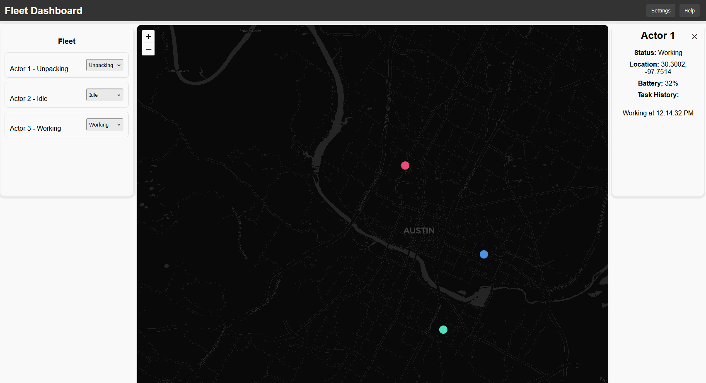

# Fleet Dashboard (Proof of Concept)

This project is a **proof of concept** for a dashboard that allows users to monitor and interact with actors (robots) performing tasks in real-time. It was built in **just an hour** to provide a visual demo, so while it's functional, it's not a full-fledged production application.

  <!-- Add your gif -->

## Table of Contents

- [Description](#description)
- [Features](#features)
- [Getting Started](#getting-started)
  - [Prerequisites](#prerequisites)
  - [Installation](#installation)
  - [Running the App](#running-the-app)
- [Deployment](#deployment)
  - [GitHub Pages](#github-pages)
  - [Netlify/Vercel](#netlify-vercel)
- [Technologies Used](#technologies-used)
- [Screenshots](#screenshots)
- [License](#license)

## Description

The **Fleet Dashboard** was created as a **quick visual demo**. It simulates real-time monitoring of actors (robots) moving around a map, performing tasks like "Working", "Charging", etc. This project was thrown together in about an hour to demonstrate the concept, so the UI and code are simple and meant to show the idea visually.

## Features

- **Real-Time Updates**: Actors' locations and statuses update every few seconds (simulated).
- **Task Management**: Assign tasks to actors directly from the dashboard.
- **Map Integration**: Visualize actors' locations using Leaflet.js with a minimal setup.
- **Actor Details Panel**: View detailed information about each actor, including location and task history.

## Getting Started

This demo can be run locally by following the instructions below.

### Prerequisites

- **Node.js**: Ensure you have Node.js installed. You can download it [here](https://nodejs.org/).
- **npm**: npm is installed with Node.js, but make sure you have the latest version:
  ```bash
  npm install -g npm
  ```

### Installation

1. **Clone the repository**:
   ```bash
   git clone https://github.com/your-username/fleet-dashboard.git
   ```

2. **Navigate to the project directory**:
   ```bash
   cd fleet-dashboard
   ```

3. **Install the dependencies**:
   ```bash
   npm install
   ```

### Running the App

1. **Start the development server**:
   ```bash
   npm start
   ```

2. **Open your browser**:
   The app will be running at `http://localhost:3000`.

## Technologies Used

- **React**: Frontend JavaScript framework.
- **Leaflet.js**: For map visualization.
- **CSS**: For styling.
- **GitHub Pages**: For deployment.
## License

This project is licensed under the MIT License
